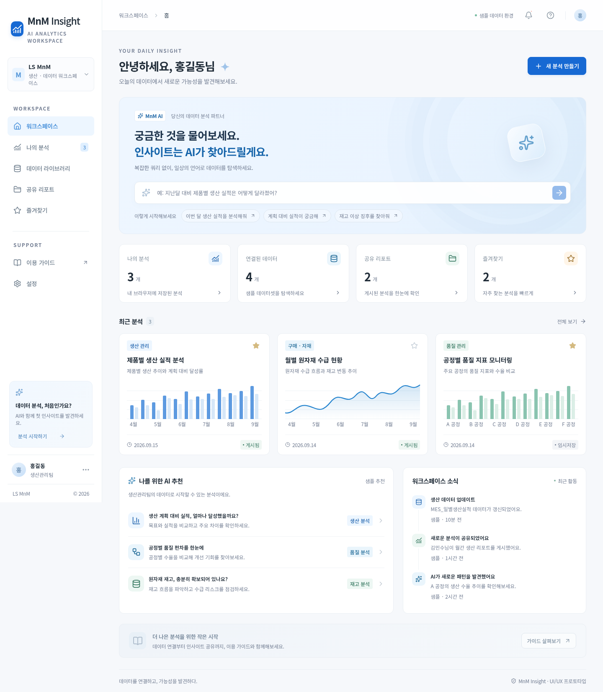

# MnM Insight

LS MnM AI 기반 데이터 분석 솔루션의 화면 설계를 바탕으로 재구성한 **Next.js · React UI/UX 프로토타입**입니다. PPTX 8개 슬라이드의 시작 화면, 데이터 준비, 대화형 입력, 조회, 데이터 연결을 검토했습니다. 원본 자료는 저장소에 포함하지 않습니다.

## 실행

- Node.js 24 권장 (Next.js 요구사항: Node.js 20.9 이상)
- npm 11 사용

```bash
npm ci --cache /workspace/.npm-cache
npm run dev
```

개발 서버의 기본 포트는 3000입니다. 캐시 경로는 환경에 맞게 변경할 수 있습니다. 외부 서비스, API 키, 데이터베이스 없이 실행됩니다. 한국어 폰트는 `@fontsource/noto-sans-kr` 패키지에서 로컬로 제공하므로 런타임 Google Fonts 요청이 없습니다.

```bash
npm run build
npm run start
npm run typecheck
npm run test:e2e
```

E2E 테스트는 **빌드 후** 실행하며 프로덕션 서버가 없으면 자동으로 시작합니다. `/usr/bin/chromium`을 사용하며 다른 환경에서는 `CHROMIUM_PATH`를 설치된 Chromium 실행 파일로 지정하세요. `npx playwright install chromium`을 사용한 경우 설정의 실행 경로를 해당 환경에 맞게 지정해야 합니다.

## 페이지 경로

| 메뉴 | 경로 |
| --- | --- |
| 워크스페이스 | `/` |
| 나의 분석 | `/analyses` |
| 데이터 라이브러리 | `/data-library` |
| 공유 리포트 | `/reports` |
| 즐겨찾기 | `/favorites` |
| 설정 | `/settings` |

각각 독립 App Router 페이지이며 사이드 메뉴는 Next.js Link를 사용합니다. 직접 URL 접속, 새로고침, 뒤로/앞으로 이동을 지원합니다. 공통 화면과 분석 다이얼로그는 공유 컴포넌트로 관리합니다.

## 구현한 기능

- 워크스페이스 대시보드: AI 질문 진입, 분석 요약, 최근 분석, 추천 분석, 활동 알림
- 분석 목록: 이름 검색, 게시 상태 필터, 즐겨찾기 및 새로고침 후 복원
- 데이터 라이브러리: 검색, 소스별 실제 샘플 미리보기, 준비 결과 저장·복원·CSV 다운로드
- 분석 생성: 목적 입력 → 데이터 준비 → 차트 선택 → 예시 인사이트 → 로컬 게시
- CSV: UTF-8, BOM, 따옴표 안의 쉼표/줄바꿈을 처리하고 열 개수 검사, 최대 5MB / 10,000행
- 데이터 준비 6단계: 불러오기 → 조회 → 연결 → 전처리 → 결과 보기 → 데이터셋 저장
- 조회: 컬럼 선택, AND 필터, 숫자/문자 정렬, 페이지별 미리보기
- 연결: 두 소스의 LEFT/INNER JOIN, 다중 연결 키, 결과 행 수 확인
- 전처리: 결측 행 제외/값 대체, 중복 제거, 달성률 계산열, 그룹별 숫자 합계
- 품질 확인: 실제 결과의 결측 셀·중복 행·숫자 오류 검사, 검증 후 저장
- AI 가이드/직접 설정 전환, 추천 소스·연결 키·전처리 적용, 최근 저장 데이터 재사용
- 모바일 메뉴, 키보드 포커스, Escape로 닫기, 다이얼로그 포커스 유지
- Radix UI 기반 공통 체크박스: 블루 선택 상태, 호버·포커스 표시, 라벨 클릭 및 Space 키 조작

## 데모의 범위

실제 AI, 사내 데이터 마트, 인증, 공동 작업 서버는 연결되어 있지 않습니다. 데이터 준비의 필터·조인·전처리·집계는 샘플 또는 업로드 CSV를 브라우저에서 실제로 처리합니다. 연결은 선택한 소스 중 주 데이터와 연결 데이터 두 개를 대상으로 하며 연결 키의 빈 값은 일치시키지 않습니다. 여러 소스의 연속 조인은 후속 범위입니다. 결측·중복은 경고 후 저장할 수 있지만 비어 있는 결과나 숫자 형식 오류는 저장 검증을 통과하지 못합니다.

AI 답변과 차트는 명시된 고정 예시이며 **준비 데이터나 업로드 CSV에서 차트를 생성하지 않습니다**. CSV는 서버로 전송하지 않습니다. 데이터셋 저장을 누르면 처리된 행·컬럼·이름·출처를 이 브라우저의 `localStorage`에 보관하며 데이터 라이브러리와 최근 사용 데이터에서 복원합니다. 저장 공간이 부족하면 오류를 표시하고 CSV 다운로드로 보관할 수 있습니다.

게시/임시저장은 분석 이름, 카테고리, 날짜, 상태, 즐겨찾기, 차트 형식만 `localStorage`에 보관합니다. 분석 목적·연결 설정·진행 단계는 저장하지 않습니다. 별도로 저장한 준비 결과 데이터셋은 데이터 라이브러리에 남습니다. 저장된 항목의 상세 화면에서는 샘플 차트를 확인하거나 같은 이름으로 새 분석을 시작할 수 있습니다. 타 사용자에게 공유되거나 이전 단계부터 재개되지는 않습니다. 브라우저 데이터를 삭제하면 저장 내역이 초기화됩니다. 알림과 사용자 프로필도 데모입니다.

개선 근거와 후속 구현 범위는 [UI/UX 개선 분석](docs/ux-review.md)을 참고하세요.

## 화면



[모바일 화면](docs/screenshots/home-mobile.png) · [검증 기록](docs/validation.md)

[데이터 준비 6단계 화면](docs/screenshots/data-preparation.png) · [연결 설정](docs/screenshots/data-join.png) · [처리 결과](docs/screenshots/data-result.png) · [모바일 데이터 준비](docs/screenshots/data-preparation-mobile.png)
